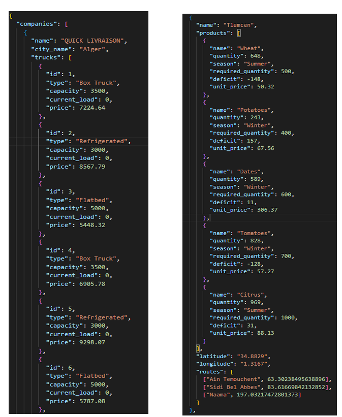
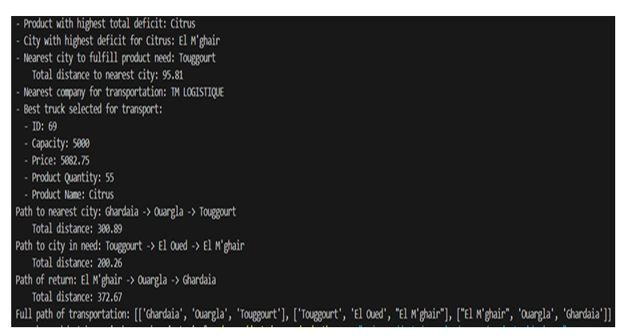
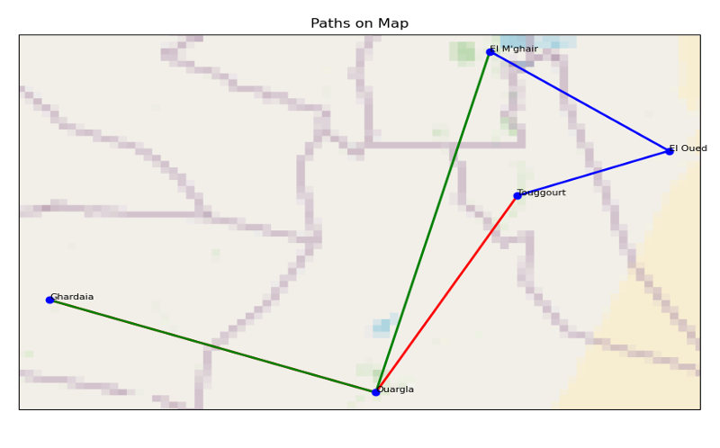

# AI-Based Supply Chain and Logistics Optimization

## Introduction

This project focuses on optimizing supply chain and logistics in Algeria, aiming to minimize delivery time, reduce costs, and ensure the timely availability of agricultural products. The project leverages search and optimization techniques to address the transportation of agricultural products across various cities in Algeria.

## Table of Contents
1. [Introduction](#introduction)
2. [Problem Description](#problem-description)
3. [Project Data](#project-data)
    - [Collection](#collection)
    - [Structure](#structure)
    - [Data Cleaning](#data-cleaning)
4. [Implementation](#implementation)
    - [Problem Formulation](#problem-formulation)
    - [Classes and Utility Functions](#classes-and-utility-functions)
    - [Transportation Optimization Functions](#transportation-optimization-functions)
    - [Auxiliary Functions for Data Handling and Visualization](#auxiliary-functions-for-data-handling-and-visualization)
    - [Demonstration of Methods](#demonstration-of-methods)
5. [Comparative Analyses](#comparative-analyses)
    - [Reduction in Product Needs](#reduction-in-product-needs)
    - [Comparison of Search Strategies](#comparison-of-search-strategies)
    - [Detailed Comparative Analysis](#detailed-comparative-analysis)
6. [Conclusion](#conclusion)
7. [References](#references)

## Problem Description

The project addresses the challenge of transporting agricultural products between various cities in Algeria. It considers the map of Algeria, recent agricultural production data, and the transportation fleet available between cities, focusing on crops like wheat, potatoes, dates, tomatoes, and citrus, while considering seasonal variations.

## Project Data

### Collection
Data was gathered from various sources, including government websites for agricultural production statistics, JSON files containing geographical information for Algeria's 58 wilayas, and a comprehensive list of transportation companies operating across different wilayas.

### Structure
The data is organized into two JSON files:
1. **City Data**: Includes city name, geographical coordinates, agricultural products (with seasonal variations, quantities, required quantities, deficits, and prices), and adjacency information for spatial analysis and route optimization.
2. **Transportation Companies**: Contains company locations, coordinates, and details of available trucks (identifiers, types, capacities, and prices).

### Data Cleaning
Python scripts were used to refine the collected data, addressing inconsistencies and missing values to ensure accuracy and reliability.

## Implementation

### Problem Formulation
The project involves different search strategies, each with a distinct initial state and goal state, but sharing the same path cost, transition model, and actions. The general framework is as follows:
- **Initial state**: Selected wilaya (depends on the search).
- **Goal state**: Selected wilaya (depends on the search).
- **Path cost**: Distance between cities (e.g., A* uses 'h + g').
- **Transition model**: Structured data.
- **Actions**: Expanding more wilayas and choosing one of them.

### Classes and Utility Functions
Several classes and utility functions are essential for the implementation:
- **CityNode class**: Represents a node in the graph search.
- **GeneralGraphSearch class**: Contains static methods for various search algorithms (A*, Hill Climbing, DFS, BFS, Simulated Annealing).
- **Haversine Distance function**: Calculates distances between cities using their coordinates.

### Transportation Optimization Functions
Functions to optimize transportation logistics:
- **Find Product with Highest Total Deficit**
- **Find City with Highest Deficit for a Specific Product**
- **Find Nearest City for Product Need**
- **Find Nearest Company to City**
- **Select Best Truck for Product Transportation**
- **Perform Transportation**

### Auxiliary Functions for Data Handling and Visualization
- **Load JSON Data**
- **Update City Product API**
- **Plot Path on Map**

### Demonstration of Methods

To demonstrate how these methods can be utilized in our project to find optimal routes and paths within our agricultural network:

1. **Load Data**: Load data from JSON files containing information about cities and transportation companies.
2. **Identify Product Deficit**: Using the provided data, identify the product with the highest deficit in general or in a given season.
3. **Search for Deficit City**: Search for the city with the highest deficit for the identified product.
4. **Select Nearest City**: Based on the identified deficit, select the nearest city to fulfill the product needs.
5. **Find Nearest Transportation Company**: Find the nearest transportation company from the city that will fulfill the product needs.
6. **Select Best Truck**: Select the best truck for transportation based on product quantity and lowest price.
7. **Execute Transportation**: The transportation process is executed using the chosen optimization technique, which can be A* search, DFS, BFS, or Simulated Annealing, depending on the project's needs and objectives.
8. **Output Results and Visualization**: Output all the previous results and visualize the transportation path.

## Comparative Analyses

### Reduction in Product Needs
Post-implementation analysis shows a notable reduction in product deficits, indicating effective optimization.

### Comparison of Search Strategies
- **A* Search and BFS**: Perform best in finding shortest paths, minimizing travel distances and transportation costs.
- **DFS and Simulated Annealing**: Exhibit suboptimal performance, leading to longer travel distances and higher costs.

### Detailed Comparative Analysis
- **Distance and Time to Transport**: A* and BFS yield shorter distances and reduced times.
- **Number of Cities Visited**: A* and BFS visit fewer cities.
- **Efficiency and Cost-Effectiveness**: A* and BFS are superior.

## Conclusion
Optimizing supply chain and logistics in Algeria is crucial for economic development and sustainability. The project demonstrates the effectiveness of search optimization techniques in minimizing delivery time, reducing costs, and ensuring the timely availability of goods.

## References
- [Transportation Company Information](https://www.europages.fr/entreprises/alg%C3%A9rie/transport%20routier.html)
- [Agricultural Production Statistics](https://madr.gov.dz/%d8%a7%d9%84%d8%a5%d8%ad%d8%b5%d8%a7%d8%a6%d9%8a%d8%a7%d8%aa-%d8%a7%d9%84%d9%81%d9%84%d8%a7%d8%ad%d9%8a%d8%a9/)
- [GitHub Repository for Algerian Cities](https://github.com/othmanus/algeria-cities/tree/master)
- [Wilaya of Algeria](https://github.com/AbderrahmeneDZ/Wilaya-Of-Algeria)
